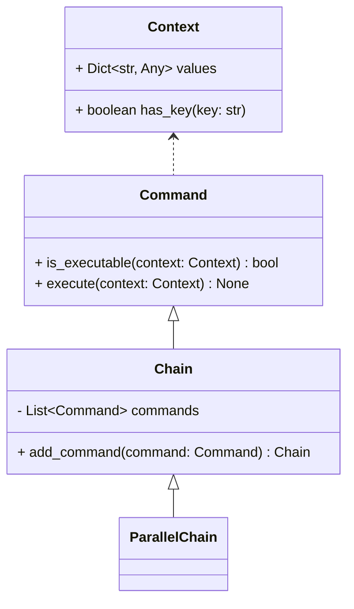

# Data Loader

## Introduction

The Data Loader users the Chain of Responsibility and Command pattern.
These patters were chose to reduce the time of adoption by providing logical
and simple extensions points.

### Chain of Responsibility


> NOTE: See the `chain.py` python file for examples: [here](chain.py).

## Default Commands

The following is a list of default commands. These commands are used in 
conjunction with the configuration file "conf/app.toml".

### Chain 1 - Validation

Used for validating the state prior to execution.

* VerifyEnvironmentCommand
* VerifyAndConnectToBigQueryCommand
* VerifyAndOrCreateBigQuerySchema

### Chain 2 - CSVLoader

This chain validates and loads the CSV file into the Retail Data Model (RDM).
The in-memory representation of RDM is then used in Chain 3 to load the data
into your cloud instance.

* CSVToRDMCommand

### Chain 3a - RT Loader Chain

This loader chain is a set of real-time, parallel tasks using a fork join strategy.
The initial command reads a single row, then hands the row to multiple excutors,
and waits for the response.

* RDMReaderCommand
* 
* RTVerifyCommand

### Chain 3b - Batch Loader Chain

This chain is used to execute in batch and requires access to the local
file system to execute. It uses the local file system to store images and
embedding text to then load the data via a batch processor. This chain IS
RECOMMENDED for large data loading.

* RDMReaderCommand
* Chain4
* JOINAndWriteCommand
* BatchLoadCommand

### Chain 4 - Parallel Chain

* ImageLoaderCommand
* GCSImageStorageCommand
* LocalImageStorageCommand
* BatchLoadImagesCommand
* EmbeddingGeneratorCommand
* LocalEmbeddingStorageCommand
* BQEmbeddingLoaderCommand

# Create Dataflow Pipeline

* Build Container Image

```shell
export PROJECT=customermod-genai-sa
export TEMPLATE_IMAGE="gcr.io/$PROJECT/dataflow/streaming-beam:latest"
gcloud builds submit --project $PROJECT --tag "$TEMPLATE_IMAGE" .
```

```shell
export BUCKET=kalschi_etl_2
export TEMPLATE_PATH="gs://$BUCKET/dataflow/templates/streaming-beam.json"

# Build the Flex Template.
gcloud dataflow flex-template build $TEMPLATE_PATH \
  --image "$TEMPLATE_IMAGE" \
  --sdk-language "PYTHON" \
  --metadata-file "metadata.json"
```

* Run

```shell


# Run the Flex Template.
# python -m dataflow_loader \
#     --region us-central1 \
#     --runner DirectRunner \
#     --project customermod-genai-sa \
#     --input_subscription="projects/customermod-genai-sa/subscriptions/rdm_topic-sub" \
#     --bucket="kalschi_etl_2" \
#     --temp_location gs://kalschi-etl-test/tmp/ 2>&1 | tee log.txt

export REGION="us-central1"

gcloud dataflow flex-template run "streaming-beam-kalschi-`date +%Y%m%d-%H%M%S`" \
    --template-file-gcs-location "$TEMPLATE_PATH" \
    --temp-location gs://kalschi-etl-test/tmp/ \
    --project $PROJECT \
    --parameters input_subscription="projects/customermod-genai-sa/subscriptions/rdm_topic-sub" \
    --parameters bucket="kalschi_etl_2" \
    --enable-streaming-engine \
    --region "$REGION"
```